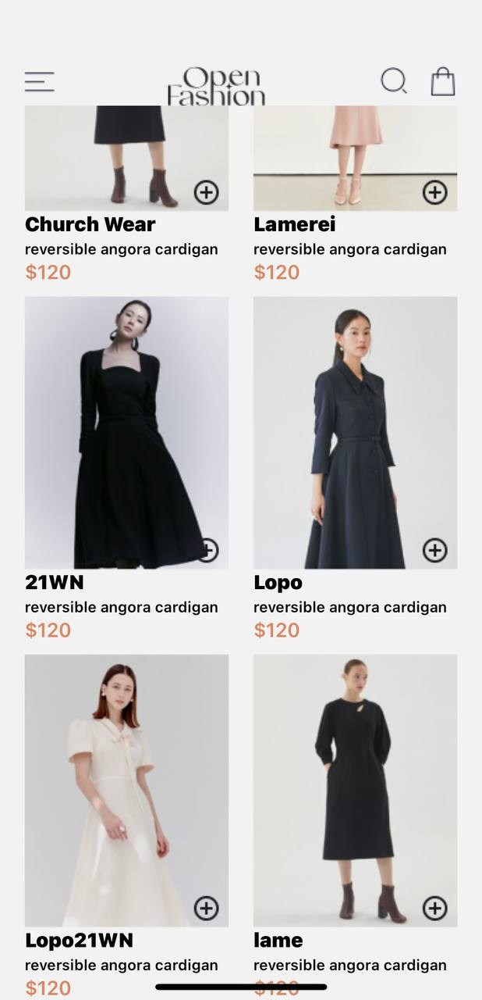
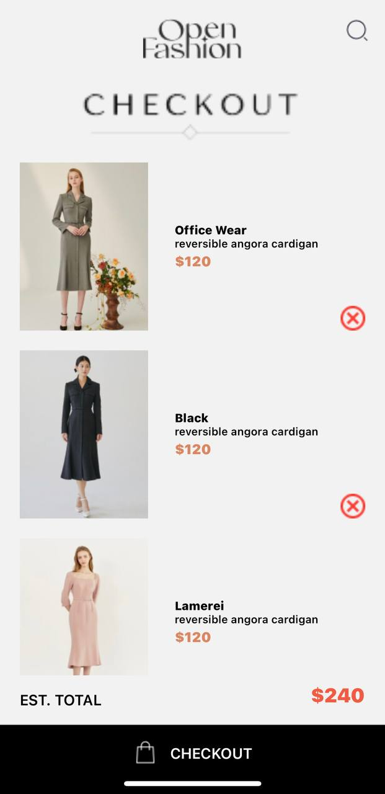

# STUDENT ID : 11289423
The app has two primary screens: HomeScreen and CartScreen.

# HomeScreen:

Displays products with "Add to Cart" buttons.
Navigation to CartScreen.

# CartScreen:

Shows items in the cart with "Remove" buttons.
Displays the total price.

# Data Storage
AsyncStorage: Used for storing and retrieving cart items.
# Implementation

- HomeScreen:

Uses FlatList to display products.
addToCart function stores items in AsyncStorage.
- CartScreen:

Retrieves and displays cart items from AsyncStorage.
removeFromCart function removes items from AsyncStorage.

Below are screenshots of the finished work:

